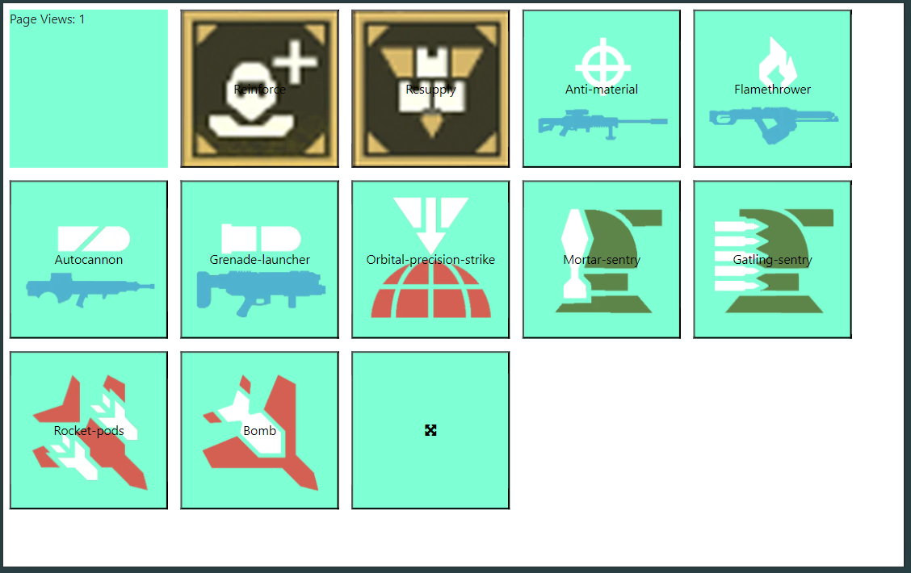

## FakeDeck - Poor Man Macro Pad

<div align="center">
    
</div>

Creates simple webserver with buttons whitch can be opened on any device an can be used as macro pad/keyboard



### How to use it ?

Just add desired macros to `configuration.yaml` and start the application, tahn zou can load dashboard on any web capable device inside of your network.

### Example Macros:
#### Helldivers 2 Macros
```yaml
- button: reinforce
  function: HelldiversTwoMacro
  parameters:
    - name: Key
      value: "reinforce"
```
```yaml
- button: strafing-run
  function: HelldiversTwoMacro
  parameters:
    - name: Key
      value: strafing-run
```
```yaml
- button: airstrike
  function: HelldiversTwoMacro
  parameters:
    - name: Key
      value: airstrike
```
```yaml
- button: cluster-bomb
  function: HelldiversTwoMacro
  parameters:
    - name: Key
      value: cluster-bomb
```
```yaml
- button: napalm-airstrike
  function: HelldiversTwoMacro
  parameters:
    - name: Key
      value: napalm-airstrike
```
```yaml
- button: smoke-strike
  function: HelldiversTwoMacro
  parameters:
    - name: Key
      value: smoke-strike
```
```yaml
- button: rocket-pods
  function: HelldiversTwoMacro
  parameters:
    - name: Key
      value: rocket-pods
```
```yaml
- button: bomb
  function: HelldiversTwoMacro
  parameters:
    - name: Key
      value: bomb
```
#### Media Control Macros
```yaml
- button: mute
  function: MediaMacro
  parameters:
    - name: Key
      value: "mute"
```
```yaml
- button: previous
  function: MediaMacro
  parameters:
    - name: Key
      value: "previous"
```
```yaml
- button: play
  function: MediaMacro
  parameters:
    - name: Key
      value: "play/pause"
```
```yaml
- button: next
  function: MediaMacro
  parameters:
    - name: Key
      value: "next"
```